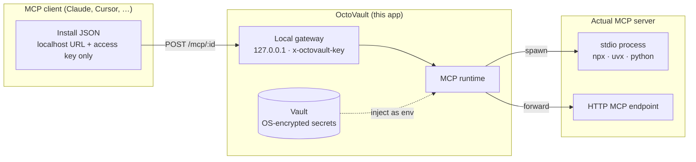
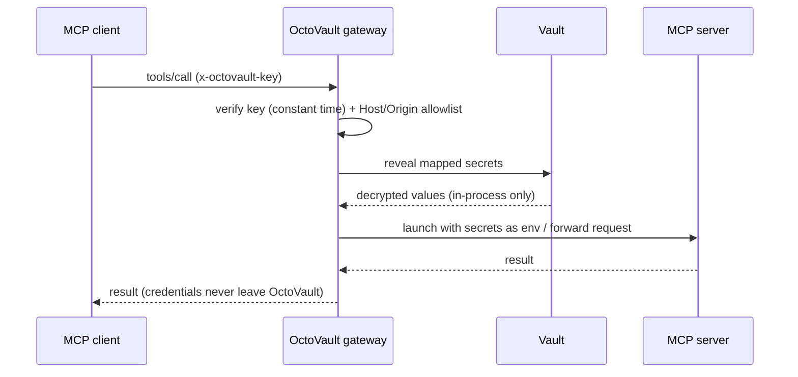

# OctoVault

**Configure MCP servers, safely.**

OctoVault is a desktop app for keeping MCP credentials local while exporting MCP
servers through a protected localhost proxy.

You **configure a server once** — its command or URL and which secrets it needs.
From then on **OctoVault is the proxy for it**: MCP clients connect to a local
`127.0.0.1` URL guarded by an access key, and OctoVault injects the real
credentials only when it launches the actual server. The client config never
contains a token.

## Why OctoVault?

- **Stop pasting tokens into client config.** MCP client config files (and the
  chat logs/screenshots around them) routinely end up holding raw API keys.
  OctoVault keeps the key in the OS keychain and hands clients a local URL.
- **One secret, many servers.** Store `GITHUB_TOKEN` once; map it into every
  server that needs it. Rotate it in one place.
- **Share config safely.** The install JSON is credential-free, so you can drop
  it in a team doc or dotfiles without leaking anything.
- **See what your MCPs do.** Per-server request, tool-call, token, and error
  counts, plus a live vault-backend status.

## How it works



A single tool call, end to end:



## Workflow

1. **Set internal secrets in the local vault**
   - Open **Vault** first.
   - Add credentials as `KEY` / `VALUE` pairs, for example `GITHUB_TOKEN`.
   - Values are encrypted locally and are never shown again.

2. **Define and export MCP servers locally**
   - Open **Servers**.
   - Add a stdio command or HTTP MCP endpoint.
   - Map env names to vault keys, for example `GITHUB_TOKEN=GITHUB_TOKEN`.
   - Click **Copy install JSON** for the client config.

3. **Use the local proxy without env params**
   - MCP clients connect to `http://127.0.0.1:<port>/mcp/<server>`.
   - Client JSON contains only the localhost URL and access key — for example:

     ```json
     {
       "mcpServers": {
         "github-tools": {
           "transport": "streamableHttp",
           "url": "http://127.0.0.1:1987/mcp/github-tools",
           "headers": { "x-octovault-key": "<generated-key>" }
         }
       }
     }
     ```

   - Credentials are injected only when OctoVault runs the actual MCP server.
   - Services using the proxy do not need the credentials.

## What it does

- Stores reusable vault secrets as local `KEY` / `VALUE` records.
- Keeps server config separate from credentials.
- Runs a protected localhost Express gateway for configured MCP servers.
- Speaks MCP **Streamable HTTP**: JSON responses, `202` for notifications,
  `Mcp-Session-Id` sessions, a `GET` SSE channel for server→client messages,
  JSON-RPC batches, and `DELETE` to end a session.
- Supports stdio MCP commands and HTTP upstream MCP endpoints.
- Issues a **per-server access key** so a shared install JSON only unlocks that
  one server; rotate it per server from the server card.
- Surfaces per-server health and the live gateway address.
- Shows dashboard metrics for vault keys, servers, env mappings, requests, tool calls, estimated tokens, and errors.
- Copies MCP install JSON by click.

## Install & run

OctoVault is distributed as a **native installer** (DMG/zip on macOS, NSIS on
Windows, AppImage/deb on Linux). It uses a native SQLite driver
(`better-sqlite3-multiple-ciphers`) for the encrypted database, which is why the
installer — not `npx` — is the distribution channel.

```bash
yarn install
yarn rebuild:native   # build the native driver for Electron's ABI
yarn bundle:mac       # or bundle:win / bundle:linux → artifacts in release/
```

> Installers should be **code-signed / notarized** before public release
> (Apple Developer ID + notarization on macOS, Authenticode on Windows) so the OS
> doesn't warn on launch. Signing needs your certificates and isn't configured here.

## Development

```bash
yarn install
yarn rebuild:native   # build the native SQLite driver for Electron's ABI (needed for `yarn start`)
yarn verify
```

Useful commands:

```bash
yarn start        # run Electron; builds missing dist assets automatically
yarn test         # node:test suite
yarn build:check  # TypeScript checks for main, renderer, and tests
yarn build        # production main + renderer assets
yarn bundle       # unpacked Electron app in release/
```

Platform installers:

```bash
yarn bundle:mac
yarn bundle:linux
yarn bundle:win
```

`electron-builder` writes artifacts to `release/`. Signing/notarization is not
configured yet. `assets/brand.svg` is the source mark; `assets/icon.png`
(1024×1024, regenerated from it) is wired as the `electron-builder` app icon for
macOS, Windows, and Linux.

## App hints

- **Vault key** is the reusable secret name stored locally, such as `OPENAI_API_KEY`.
- **Env → vault key** maps the environment variable expected by an MCP server to a vault key. Example: `GITHUB_TOKEN=GITHUB_TOKEN`.
- **Working dir** is the optional folder where a stdio command starts. Use it for project files, relative config, or local `.env` files.
- **Enabled** controls whether the local proxy route is active.
- **Estimated tokens** are an approximation based on JSON payload size. They are for local visibility, not billing.

## Safety model

- Secret values are write-only in the UI and never returned to the renderer.
- **The entire config database is encrypted at rest** (SQLCipher) with a key
  sealed by the OS keychain — server names, commands, env values and all. Nothing
  in `vault.db` is plaintext on disk. The app decrypts on open, so the UI still
  shows everything normally.
- Secret env values are **additionally** sealed with `safeStorage` and never
  leave the main process; non-secret "custom" values are visible in the UI.
- Electron `safeStorage` (OS keychain) is used when available.
- Linux `basic_text` storage is blocked instead of silently storing weak secrets.
- The fallback provider derives an AES-256-GCM key with `scrypt` over a
  per-install random salt from `OCTOVAULT_PASSWORD`. Without a password it stays
  **blocked** rather than encrypting under a known default key.
- The gateway binds to `127.0.0.1`, validates local Host/Origin headers, and
  requires `x-octovault-key`, compared in constant time.
- The gateway access key is generated once and **persisted**, so exported client
  JSON keeps working across restarts.
- Each server also gets its **own access key**; the `/mcp/<server>` route accepts
  that key or the master key, so a shared per-server config is scoped to one
  server. Rotate a server's key anytime from its card.
- Access keys are **sealed at rest** with `safeStorage` (cached in memory for the
  request path). If the keychain can't decrypt them after a restart the key is
  re-issued (re-copy that install JSON); with no keychain they persist as
  plaintext so they still survive restarts.
- The packaged renderer runs under a strict Content-Security-Policy and Electron
  sandbox (`contextIsolation`, no `nodeIntegration`).
- The store directory (`~/.octovault`) is created `0700` and `vault.db` `0600`,
  so other OS users can't read the encrypted secrets or keys.
- Exported MCP JSON does not include env values or secret material.

> Local-machine trust boundary: secrets are protected at rest and from other OS
> users, but — like any local secret store — a process running as **you** can
> reach the localhost proxy. For stricter isolation, run OctoVault as a dedicated
> OS user.
